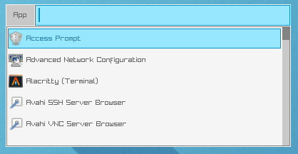
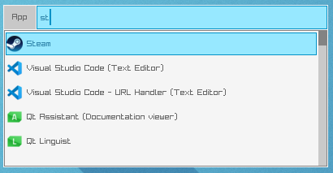

# cofi

A minimal application launcher for Linux. It reads `.desktop` files from `/usr/share/applications/`, displays a searchable list with icons, and launches the selected application.

Terminal applications are wrapped with `alacritty -e`.

## Requirements

- Linux x86_64
- `alacritty` (for terminal applications)
- `wget` (only needed on first build, to fetch raylib)

## Build

```sh
make
```

This produces `build/cofi`. On the first run, raylib 5.5 is automatically downloaded and extracted if not already present.

```sh
make clean  # remove build artifacts
```

## Screenshots




## Usage

Run `build/cofi`, type to filter applications, and press Enter or click to launch.

## Dependencies

- [raylib 5.5](https://github.com/raysan5/raylib) — windowing and rendering
- [raygui](https://github.com/raysan5/raygui) — immediate-mode UI (modified, bundled in `src/thirdparty/`)
- [da.h](src/thirdparty/da.h) — custom dynamic array library (bundled)

## License

See [LICENSE](LICENSE).
